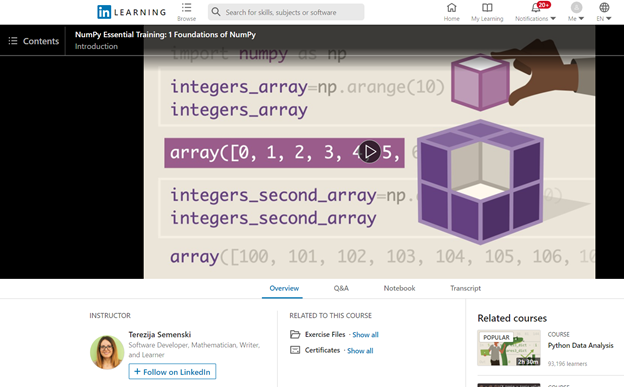

# Numpy

Numpy is the most important external library we will use in this course, and it is important to become very comfortable with it. To start, please go through:
- Watch the following [short LinkedIn Learning video](https://www.linkedin.com/learning/python-data-analysis-2/numpy-overview?u=56982905).
- [Numpy Introduction from W3Schools](https://www.w3schools.com/python/numpy_intro.asp). This interactive tutorial introduces you to the Numpy library and, helpfully, you can run the examples directly in the browser.
- Numpy's official website provides a valuable additional resource, [Numpy: The absolute basics for beginners](https://numpy.org/devdocs/user/absolute_beginners.html)

Once you have a basic familiarity with Numpy, you can complete the LinkedIn Learning [Numpy Essential Training 1: Foundations of NumPy](https://www.linkedin.com/learning/numpy-essential-training-1-foundations-of-numpy?u=56982905) and submit your certificate to complete this assignment.

