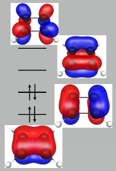

Problem 10 uses the following figure, which is not rendering for some people

----
*Problem 11 uses the following detailed problem description.*

Modern displays often use quantum dot technology, where one (or more) electrons are confined to a region within a material. For an electron confined to a rectangular region in two dimensions, it is reasonable to approximate its motion perpendicular to the rectangle with harmonic confinement. The time-independent Schr&ouml;dinger equation, eigenfunctions, and eigenvalues for a harmonically confined electron are, in atomic units:

$$
\left(-\tfrac{1}{2}\tfrac{d^2}{dz^2} + \tfrac{1}{2}\kappa z^2\right) \psi_k(z) = E_k \psi_k(z)
$$

where the eigenenergies are

$$
E_k = \sqrt{\kappa}\left(k+\tfrac{1}{2}\right) \qquad \qquad k=0,1,2,\ldots
$$

and the eigenfunctions are given in terms of the [Hermite polynomials](https://en.wikipedia.org/wiki/Hermite_polynomials), $H_k(z)$, as:

$$
\psi_k^{(\text{harm. osc.})}(z) =\frac{1}{2^k k!}\sqrt[4]{\frac{\kappa}{\pi}}
e^{-\sqrt{\kappa}z^2/2}H_k\left(\sqrt[4]{\kappa}z\right)
$$

The Hamiltonian for an electron confined to a rectangular region, in atomic units, is then:

$$
\hat{H} = -\frac{1}{2} \frac{d^2}{dx^2} -\frac{1}{2} \frac{d^2}{dy^2} -\frac{1}{2} \frac{d^2}{dz^2} + V_{a_x}(x) + V_{a_y}(y) + \frac{1}{2} \kappa z^2
$$

where

$$
V_a(x) = 
\begin{cases}
    +\infty & x\leq 0\\
    0       & 0\lt x \lt a\\
    +\infty & a \leq x
\end{cases}
$$

**11.** &#x270d;&#xfe0f;&#x1F5A9; **What is the wavelength that corresponds to the lowest-energy excitation when $a_x = 16$, $a_y = 9$, and $k_z = 4$?** Report your answer in nm. *Hint: You may find it useful to recall that the speed of light is 137.036 in atomic units.*
