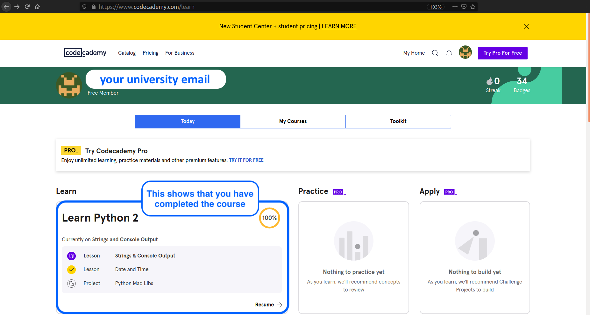

# Extra Credit Problems for Jupyter, Python, Numpy, etc.

You can complete additional courses on LinkedIn Learning or other venues for extra credit. The below links are curated to be especially helpful and useful, but almost any online activity that you complete and can document the completion of is acceptable. I've indicated how many pages of homework this is considered to be equivalent to.

## [Codecademy Python 2](https://www.codecademy.com/learn/learn-python)

- This is Python 2, but Python 3 isn't very different, and the Python 3 course requires a (paid) subscription to Codecademy, while the Python 2 course does not. To do this assignment, sign up for Codecademy (free) and work through the 12 topical modules by reading about Python syntax and solving the interactive web-based exercises on your own. If you get stuck, you'll be provided with instructive hints. This [course](https://www.codecademy.com/learn/learn-python) will take *much* less than the time they estimate, because you can skip projects and quizzes that are accessible only through a (paid) PRO account. **(100 points)**

  - Instructions: Take a screenshot of the certificate of completion and submit it for the extra credit marks. See image below.

## Linkedin Learning

You can complete relevant LinkedIn Learning courses to earn extra credit; one will earn roughly 10 points/hour by doing this, though I will "round up" somewhat because working through the material in these courses does take time, I know. For example, you can choose to complete some of the courses you've already (partly) seen in the course material.

- [Programming Foundations: Fundamentals](https://www.linkedin.com/learning/programming-foundations-fundamentals-3/the-fundamentals-of-programming?u=56982905)
- [Python Data Analysis](https://www.linkedin.com/learning/python-data-analysis-2/get-started-in-data-analysis-with-python?u=56982905)
- [Julia Power like Python, Speed like C](https://www.linkedin.com/learning/learning-julia/julia-power-like-python-speed-like-c)

  - Instructions: Submit the LinkedIn Learning certificate of completion for extra credit.

## Online Python Tests

- [**Python Exercises from W3Schools**](https://www.w3schools.com/python/exercise.asp) 95 simple interactive questions grouped by topic. **(~1 hour; 10 points)**

  - Instructions: Try to solve an exercise by filling in the missing parts of code. If you got stuck, hit the "Show Answer" button to see what you've done wrong. If you need to practice a certain topic more, you can go directly to the associated interactive tutorial. At the end, submit a screenshot showing "Completed 95 of 95 Exercises" for extra credit.

- [**Python Quiz from W3Schools**](https://www.w3schools.com/quiztest/quiztest.asp?qtest=PYTHON) 25 multiple-choice questions. **(~10 minutes; 3 points)**

  - Instructions: Your total score and the correct answers will be displayed at the end of the quiz. Take a screen shot of this page and receive up to 3 points (depending on your score).

- [**PYnative Python Quizzes**](https://pynative.com/python-quizzes/) 14 topic-specific quizzes each with ~15 questions each. **(~5 minutes per quiz; 2 points)**

  - Instructions: Click on “Solve Quiz” to test your knowledge on each topic. Upon submitting, your score, correct answers are displayed. Take a screenshot of the "passed" quiz and submit it for extra credit.

- [**Interactive Python Quizzes from Real Python**](https://realpython.com/quizzes/) A collection of short interactive quizzes. **(~5 minutes per quiz; 2 points)**

  - Instructions: Take the quiz and then submit a screenshot of the score report to show that you passed the quiz.

- [**Exercism**](http://exercism.io/) Free mentor-based learning pathways for [Python](https://exercism.io/tracks/python), [Julia](https://exercism.io/tracks/julia), and much more.

  - Instructions: If you use Exercism, you would be able to submit work you create therein for extra credit.
