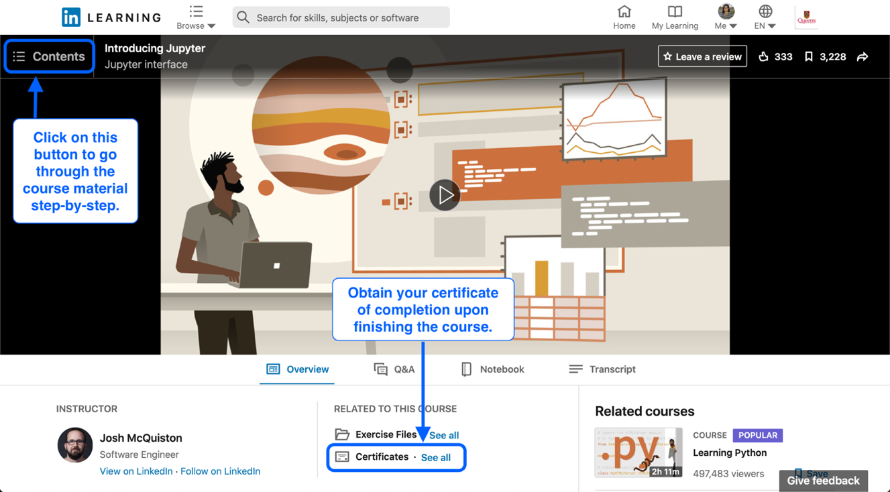

# Jupyter

Go through the content of the LinkedIn Learning [Introducing Jupyter](https://www.linkedin.com/learning/introducing-jupyter/) course step-by-step and take the time to practice the material covered in a Jupyter notebook. Upon completing this course, turn in your certificate of completion on Microsoft Teams to show you have completed this assignment, as shown below. For information on how to turn in an assignment with Microsoft Teams, see the [webpage](https://support.microsoft.com/en-us/office/turn-in-an-assignment-in-microsoft-teams-e25f383a-b747-4a0b-b6d5-a2845a52092b).

