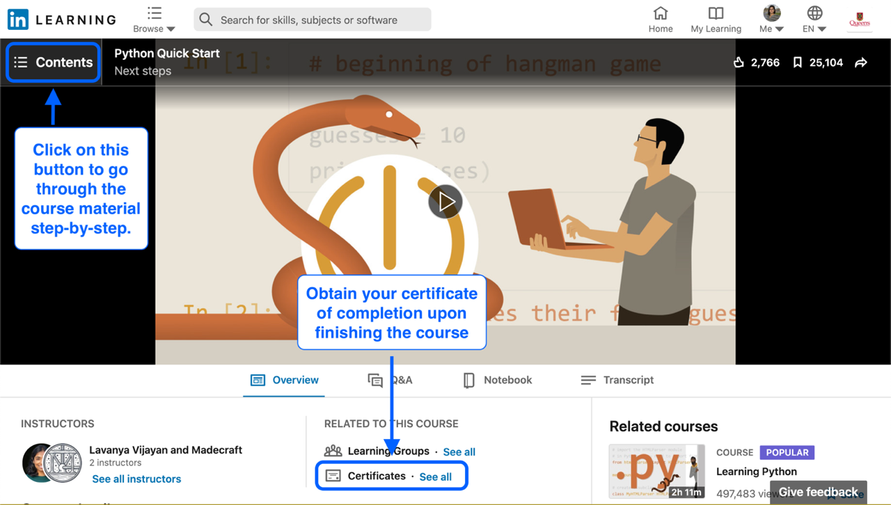

# Python Programming

Go through the content of the LinkedIn Learning [Python Quick Start](https://www.linkedin.com/learning/python-quick-start/) course step-by-step and take the time to practice the material covered in a Jupyter notebook. Upon completing this course, add your certificate of completion to your `Course-Certificates` GitHub repository and reference it in `README.md`.

